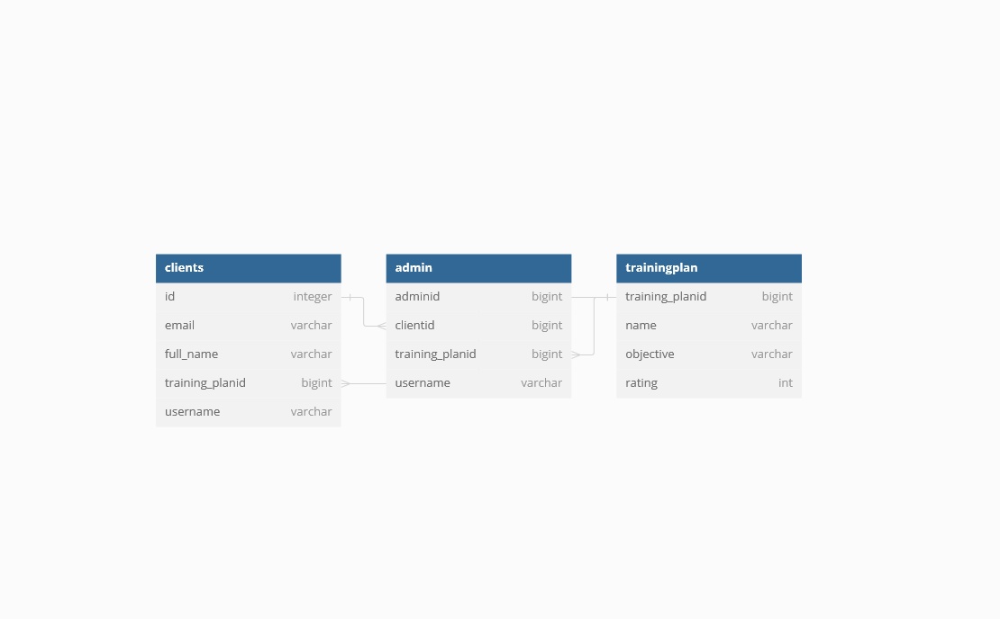

# Fitness Coach App Documentation

## Overview
The Fitness Coach App is a sophisticated application designed to provide personalized training plans to users based on their fitness objectives. Utilizing the Spring Boot framework, Java programming language, and SQL database management, this app offers a seamless experience for both fitness coaches and clients.

## Main Features
### 1. Personalized Training Plans
The core functionality of the Fitness Coach App revolves around creating customized training plans for each client. These plans are tailored to meet the individual's specific fitness goals, whether it's weight loss, muscle gain, or overall fitness improvement.

### 2. SOLID Principles Integration
The app is built adhering to the SOLID principles of object-oriented design, ensuring high cohesion, low coupling, and easy maintenance. Each module of the application is designed to have a single responsibility, promoting code reusability and extensibility.

### 3. Spring Boot Framework
The use of the Spring Boot framework provides a robust and scalable foundation for the Fitness Coach App. It offers features such as dependency injection, aspect-oriented programming, and easy configuration, facilitating rapid development and deployment of the application.

### 4. Java Programming Language
Java serves as the primary programming language for implementing the business logic and functionalities of the Fitness Coach App. Its object-oriented nature, platform independence, and extensive ecosystem make it an ideal choice for building enterprise-level applications.

### 5. SQL Database Management
The app utilizes SQL databases to store user information, training plans, and progress tracking data. SQL (Structured Query Language) enables efficient data retrieval, manipulation, and storage, ensuring the app's reliability and scalability.

### 6. Observer Pattern Implementation
To enhance real-time updates and user engagement, the Fitness Coach App incorporates the Observer pattern. This design pattern enables efficient communication between components, allowing clients to receive instant notifications about any changes in their training plans, progress, or upcoming events. By implementing the Observer pattern, the app ensures that users stay informed and motivated throughout their fitness journey, fostering a dynamic and interactive experience. Additionally, administrators also benefit from the Observer pattern, receiving notifications about new client registrations, allowing them to efficiently manage user accounts and provide support as needed.

## How It Works
1. **User Registration**: Clients register on the app by providing their personal details and fitness objectives.
   
2. **Objective Assessment**: The app conducts a thorough assessment of the user's fitness goals, current fitness level, and any specific requirements or restrictions.

3. **Algorithmic Analysis**: Based on the assessment, the app employs algorithms to generate a personalized training plan tailored to the user's objectives, preferences, and constraints.

4. **Plan Presentation**: The generated training plan is presented to the user through an intuitive interface, detailing exercises, sets, repetitions, rest intervals, and progression metrics.

## Conclusion
The Fitness Coach App offers a comprehensive solution for individuals seeking personalized fitness guidance and training plans. By leveraging the power of Spring Boot, Java, and SQL, along with adherence to SOLID principles, the app provides a seamless and effective platform for achieving fitness goals.
