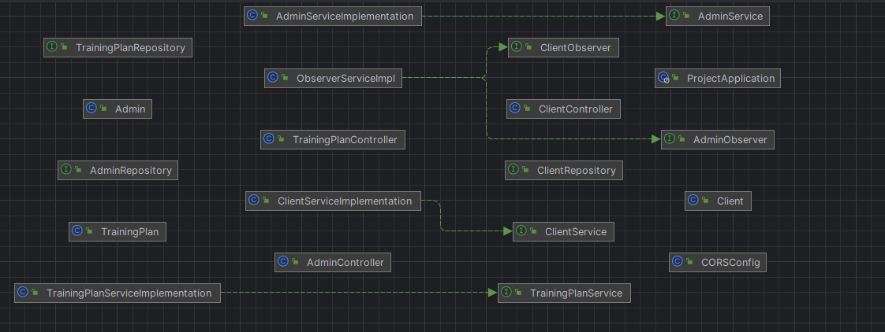
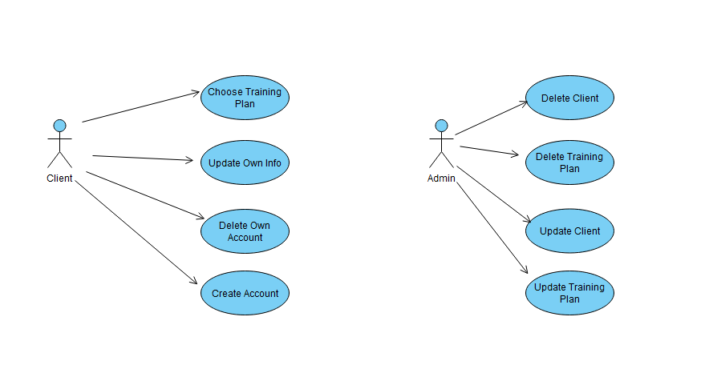

# Fitness Coach App Documentation

## Overview
The Fitness Coach App is a sophisticated application designed to provide personalized training plans to users based on their fitness objectives. Utilizing the Spring Boot framework, Java programming language, and SQL database management, this app offers a seamless experience for both fitness coaches and clients.

## Main Features
### 1. Personalized Training Plans
The core functionality of the Fitness Coach App revolves around creating customized training plans for each client. These plans are tailored to meet the individual's specific fitness goals, whether it's weight loss, muscle gain, or overall fitness improvement.

### 2. SOLID Principles Integration
The app is built adhering to the SOLID principles of object-oriented design, ensuring high cohesion, low coupling, and easy maintenance. Each module of the application is designed to have a single responsibility, promoting code reusability and extensibility.

### 3. Spring Boot Framework
The use of the Spring Boot framework provides a robust and scalable foundation for the Fitness Coach App. It offers features such as dependency injection, aspect-oriented programming, and easy configuration, facilitating rapid development and deployment of the application.

### 4. Java Programming Language
Java serves as the primary programming language for implementing the business logic and functionalities of the Fitness Coach App. Its object-oriented nature, platform independence, and extensive ecosystem make it an ideal choice for building enterprise-level applications.

### 5. SQL Database Management
The app utilizes SQL databases to store user information, training plans, and progress tracking data. SQL (Structured Query Language) enables efficient data retrieval, manipulation, and storage, ensuring the app's reliability and scalability.

# Tables

## clients
- **id**: integer, primary key
- **email**: varchar, email address of the client
- **full_name**: varchar, full name of the client
- **training_planid**: bigint, foreign key referencing `trainingplan.training_planid`
- **username**: varchar, username of the client

## admin
- **adminid**: bigint, primary key
- **clientid**: bigint, foreign key referencing `clients.id`
- **training_planid**: bigint, foreign key referencing `trainingplan.training_planid`
- **username**: varchar, username of the admin

## trainingplan
- **training_planid**: bigint, primary key
- **name**: varchar, name of the training plan
- **objective**: varchar, objective of the training plan
- **rating**: int, rating of the training plan

# Relationships

- **clients** table has a foreign key `training_planid` that references the `training_planid` in the **trainingplan** table. This implies that each client is associated with one training plan.
- **admin** table has two foreign keys: `clientid` and `training_planid`. The `clientid` references the `id` in the **clients** table, and the `training_planid` references the `training_planid` in the **trainingplan** table. This indicates that each admin is associated with a specific client and a specific training plan.

# Implementation

## Entity

- **Client** , **Admin** , **TrainingPlan**
- These classes represent the main entities that will be present in the database.
- Said classes have anotations so that they are automatically created in the database.
- The IDs of these classes are set to auto-increment.

## Repository

- **ClientRepository** , **AdminRepository** , **TrainingPlanRepository**
- These interfaces extend `JpaRepository` so that the app can communicate with the database
- There is a repository interface for each of the three classes in the Entity package.

## Service
- **ClientService** , **AdminService** , **TrainingPlanService**
## AdminService

The AdminService interface defines the operations for managing Admin entities. It includes methods to:

- **Retrieve all admins**: `List<Admin> getAllAdmins()`
- **Retrieve an admin by ID**: `Admin getAdminById(Long id)`
- **Create a new admin**: `Admin createAdmin(Admin admin)`
- **Update an existing admin**: `Admin updateAdmin(Long id, Admin adminDetails)`
- **Delete an admin**: `void deleteAdmin(Long id)`

This service is responsible for the business logic related to admins, such as creating, reading, updating, and deleting admin records.

## ClientService

The ClientService interface defines the operations for managing Client entities. It includes methods to:

- **Retrieve all clients**: `List<Client> getAllClients()`
- **Retrieve a client by ID**: `Client getClientById(Long id)`
- **Create a new client**: `Client createClient(Client client)`
- **Update an existing client**: `Client updateClient(Long id, Client clientDetails)`
- **Delete a client**: `void deleteClient(Long id)`
- **Retrieve clients without a training plan**: `List<Client> getClientsWithNoTrainingPlan()`

This service handles the business logic for client management, ensuring that client data is properly handled and maintained.

## TrainingPlanService

The TrainingPlanService interface defines the operations for managing TrainingPlan entities. It includes methods to:

- **Retrieve all training plans**: `List<TrainingPlan> getAllTrainingPlans()`
- **Retrieve a training plan by ID**: `TrainingPlan getTrainingPlanById(Long id)`
- **Create a new training plan**: `TrainingPlan createTrainingPlan(TrainingPlan trainingPlan)`
- **Update an existing training plan**: `TrainingPlan updateTrainingPlan(Long id, TrainingPlan trainingPlanDetails)`
- **Delete a training plan**: `void deleteTrainingPlan(Long id)`

This service is responsible for the business logic concerning training plans, including the creation, retrieval, updating, and deletion of training plan records.

## Service Implementation
- Implements the service methods listed above

## Controller
- **ClientController** , **AdminController** , **TrainingPlanController**
- Is responsible for implement the HTTP endpoints
- GET , PUT, POST , DELETE

### 6. Observer Pattern Implementation
To enhance real-time updates and user engagement, the Fitness Coach App incorporates the Observer pattern. This design pattern enables efficient communication between components, allowing clients to receive instant notifications about any changes in their training plans, progress, or upcoming events. By implementing the Observer pattern, the app ensures that users stay informed and motivated throughout their fitness journey, fostering a dynamic and interactive experience. Additionally, administrators also benefit from the Observer pattern, receiving notifications about new client registrations, allowing them to efficiently manage user accounts and provide support as needed.

## How It Works
1. **User Registration**: Clients register on the app by providing their personal details and fitness objectives.
   
2. **Objective Assessment**: The app conducts a thorough assessment of the user's fitness goals, current fitness level, and any specific requirements or restrictions.

3. **Algorithmic Analysis**: Based on the assessment, the app employs algorithms to generate a personalized training plan tailored to the user's objectives, preferences, and constraints.

4. **Plan Presentation**: The generated training plan is presented to the user through an intuitive interface, detailing exercises, sets, repetitions, rest intervals, and progression metrics.

### 7. Endpoints
## AdminController

- **GET /admins/get**
    - **Usage**: Retrieves all admins.
    - **Returns**: List of all admin entities.

- **GET /admins/getbyID/{id}**
    - **Usage**: Retrieves an admin by their ID.
    - **Returns**: Admin entity if found, otherwise a 404 error.

- **POST /admins/save**
    - **Usage**: Creates a new admin.
    - **Returns**: The created admin entity with HTTP status 201 (Created).

- **PUT /admins/updatebyID/{id}**
    - **Usage**: Updates an existing admin by ID.
    - **Returns**: The updated admin entity if found, otherwise a 404 error.

- **DELETE /admins/deletebyID/{id}**
    - **Usage**: Deletes an admin by their ID.
    - **Returns**: No content with HTTP status 204 (No Content).

## ClientController

- **GET /clients/get**
    - **Usage**: Retrieves all clients.
    - **Returns**: List of all client entities.

- **GET /clients/getbyID/{id}**
    - **Usage**: Retrieves a client by their ID.
    - **Returns**: Client entity if found, otherwise a 404 error.

- **POST /clients/save**
    - **Usage**: Creates a new client.
    - **Returns**: The created client entity with HTTP status 201 (Created).

- **PUT /clients/updatebyID/{id}**
    - **Usage**: Updates an existing client by ID.
    - **Returns**: The updated client entity if found, otherwise a 404 error.

- **DELETE /clients/deletebyID/{id}**
    - **Usage**: Deletes a client by their ID.
    - **Returns**: No content with HTTP status 204 (No Content).

## TrainingPlanController

- **GET /trainingplans/get**
    - **Usage**: Retrieves all training plans.
    - **Returns**: List of all training plan entities.

- **GET /trainingplans/getbyID/{id}**
    - **Usage**: Retrieves a training plan by their ID.
    - **Returns**: Training plan entity if found, otherwise a 404 error.

- **POST /trainingplans/save**
    - **Usage**: Creates a new training plan.
    - **Returns**: The created training plan entity with HTTP status 201 (Created).

- **PUT /trainingplans/updatebyID/{id}**
    - **Usage**: Updates an existing training plan by ID.
    - **Returns**: The updated training plan entity if found, otherwise a 404 error.

- **DELETE /trainingplans/deletebyID/{id}**
    - **Usage**: Deletes a training plan by their ID.
    - **Returns**: No content with HTTP status 204 (No Content).

These endpoints allow CRUD (Create, Read, Update, Delete) operations for Admin, Client, and TrainingPlan entities in the system.

### 8. Unit Testing

## ClientsTest

The ClientsTest class includes unit tests for the ClientService implementation. These tests are used to verify that the service methods for managing client entities function correctly. Specifically, the tests ensure that:

- **createClientTest**: A client is successfully created and saved.
- **deleteClientTest**: Clients are successfully deleted.
- **updateClientTest**: Clients are successfully updated.
- **getAllClientsTest**: All clients are retrieved successfully.

## TrainingPlanTests

The TrainingPlanTests class includes unit tests for the TrainingPlanService implementation. These tests ensure the correct functionality of service methods for managing training plan entities. The tests verify that:

- **createTrainingPlanTest**: A training plan is successfully created and saved.
- **deleteTrainingPlanTest**: Training plans are successfully deleted.
- **updateTrainingPlanTest**: Training plans are successfully updated.
- **getAllTrainingPlansTest**: All training plans are retrieved successfully.

## AdminTests

The AdminTests class includes unit tests for the AdminService implementation. These tests verify the service methods for managing admin entities function as expected. The tests ensure that:

- **createAdminTest**: An admin is successfully created and saved.
- **deleteAdminTest**: Admins are successfully deleted.
- **updateAdminTest**: Admins are successfully updated.
- **getAdminTest**: All admins are retrieved successfully.

# Diagrams
## Class Diagram

The class diagram illustrates the structure and relationships between various components of the application, including:

- **Controllers**: `AdminController`, `ClientController`, `TrainingPlanController` handle HTTP requests related to Admin, Client, and TrainingPlan entities.
- **Service Implementations**: `AdminServiceImplementation`, `ClientServiceImplementation`, `TrainingPlanServiceImplementation` contain business logic for managing Admin, Client, and TrainingPlan entities.
- **Repositories**: `AdminRepository`, `ClientRepository`, `TrainingPlanRepository` interface with the database to perform CRUD operations on Admin, Client, and TrainingPlan entities.
- **Entities**: `Admin`, `Client`, `TrainingPlan` represent the data models for admins, clients, and training plans.
- **Services**: `AdminService`, `ClientService`, `TrainingPlanService` define the service operations for Admin, Client, and TrainingPlan entities.
- **Observers**: `ClientObserver`, `AdminObserver`, `ObserverServiceImpl` implement observer patterns for changes in Client and Admin entities.
- **ProjectApplication**: The main class to bootstrap the application.
- **CORSConfig**: Configuration class for handling Cross-Origin Resource Sharing settings.

The diagram shows how these components interact to manage and process data within the application.

# Use Case Diagram

## Actors:

- **Admin**: Can manage admins, clients, and training plans, and can log in to the system.
- **Client**: Can manage their own information and training plans.

## Use Cases:

- **Manage Admins**: Admin can perform CRUD operations on admin entities.
- **Manage Clients**: Admin and Client can perform CRUD operations on client entities.
- **Manage Training Plans**: Admin and Client can perform CRUD operations on training plans.
- **Login**: Admin can log in to access the system's functionalities.

## Relationships:

- **Admin interacts with**:
  - Manage Admins
  - Manage Clients
  - Manage Training Plans
  - Login

- **Client interacts with**:
  - Manage Clients
  - Manage Training Plans

# Front-End Documentation

## TrainingPlanDetailsTable.js

This component is used to display detailed information about a specific training plan in a tabular format. It includes columns for ID, Name, Objective, and Rating of the training plan.

## TrainingPlansTable.js

This component is used to display a list of training plans in a table format. Each row represents a training plan and includes columns for ID, Name, Objective, and Rating. It maps over an array of training plans to generate the table rows dynamically.

## AdminHandler.js

This component manages the administration functionalities, including handling the display of clients and training plans. It integrates various sub-components like ClientsTable, ClientDetailsTable, TrainingPlansTable, and TrainingPlanDetailsTable. It is likely responsible for fetching and managing data related to admins, clients, and training plans.

## ClientDetailsTable.js

This component is used to display detailed information about a specific client in a tabular format. It includes columns for the client's attributes such as ID, Name, Email, Phone Number, and Goal.

## ClientsTable.js

This component is used to display a list of clients in a table format. Each row represents a client and includes columns for ID, Name, Email, Phone Number, and Goal. It maps over an array of clients to generate the table rows dynamically.

## LoginPage.js

This component provides a login interface for admin users. It includes a form where admins can enter their ID to log in. Upon successful login, it renders the AdminHandler component. It handles login logic, including error handling and displaying notifications.

# Front-End Technologies

- CSS
- JavaScript
- React

# Front-End Features
- Clean login page for admins
- Clean and easy to use interface for the app endpoints

## Conclusion
The Fitness Coach App offers a comprehensive solution for individuals seeking personalized fitness guidance and training plans. By leveraging the power of Spring Boot, Java, and SQL, along with adherence to SOLID principles, the app provides a seamless and effective platform for achieving fitness goals.
